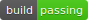

# Ubuntu-Setup-Scripts

my setup scripts for newly installed Ubuntu OS

`14.04-setup.sh` is designed for and tested on Ubuntu 14.04 x64 kernel 4.4.0-121 generic

P.S.

- Setup script contains **unreachable commands** (because oh-my-zsh setup will terminate current bash process), I don't plan to resolve this issue. But **recommend** to manually execute unreachable commands to complete setup script.
- Flatabulous theme is enabled via manually setup in unity tweak tool.

## Run

use command `sudo sh 14.04-setup.sh`

## Termination

`ctrl-c`

## TODO

- [ ] Ubuntu 18.04 x64 Setup script
